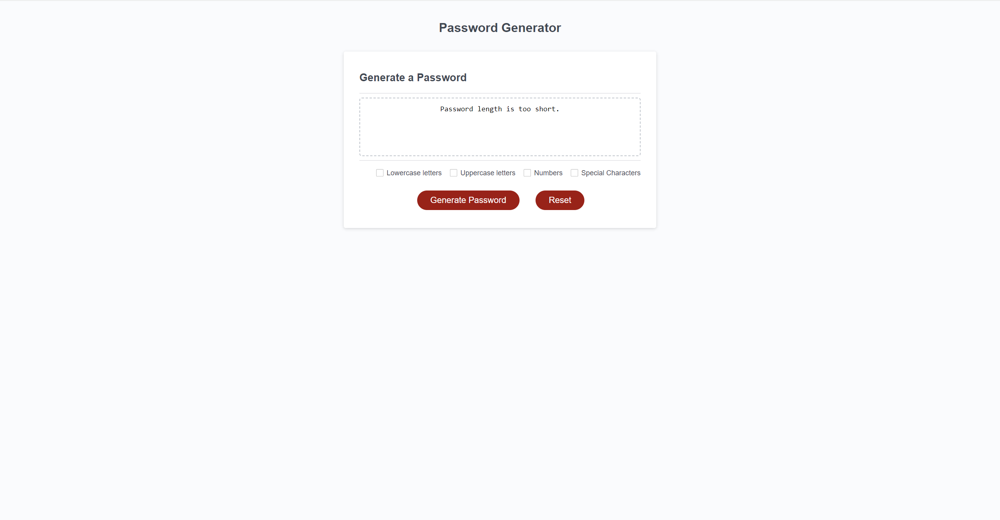
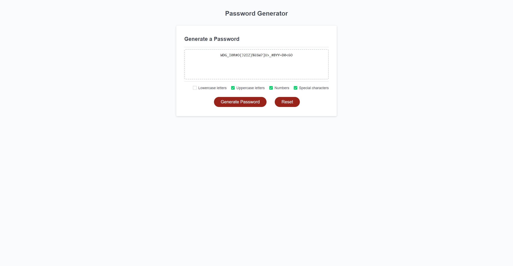

# Password Generator

## Description
This webpage is a random password generator. When the "Generate Password" button is clicked, the webpage prompts the user to select options about the content of the password, then generates a random password based on that information. A "Reset" button is included to clear the previous work.

## Usage
To use the page, begin by clicking the "Generate Password" button. A series of prompts will be displayed. The first will ask how long you want your password to be. You may enter any number between 8 and 128, and if a value outside this range is chosen, a message will be displayed in the password box saying so.

After a valid password length is inputted, more options will be given, asking the user what types of characters should be used in making the password. After each of these options are inputted, the website will generate the password and display it on screen. Green checkmarks appear next to each name of the character sets that are being used.

The "Reset" button can then be clicked to reset the webpage, or you can click the "Generate Password" button again to generate a new password.

## License
This webpage uses the MIT License.